# 🍷 Red Wine Quality Prediction – End-to-End ML Pipeline


This project implements a modular and scalable **machine learning pipeline** for predicting red wine quality using physicochemical properties. It follows a clean MLOps-style structure with **experiment tracking as the main focus**, using tools like **MLflow** and **DagsHub** for monitoring metrics, parameters, and model versions.

---

## 🎯 Project Objective

The main goal of this project is to **automate and structure the ML lifecycle** while enabling **experiment tracking and reproducibility**. It is designed to:

- 🔄 Streamline data ingestion, validation, transformation, model training, and evaluation
- ⚙️ Enable full control through external YAML configuration
- 📊 Track and compare experiments using **MLflow** and **DagsHub**
- 🏗️ Serve as a reusable template for real-world ML workflows
- 🚀 Demonstrate best practices in MLOps and experiment management

---

## 🔁 ML Pipeline Workflow

```mermaid
graph LR
    A[📥 Data Ingestion] --> B[✅ Data Validation]
    B --> C[🔄 Data Transformation]
    C --> D[🧠 Model Training]
    D --> E[📊 Model Evaluation]
    E --> F[🎯 MLflow Tracking]
    F --> G[📈 DagsHub Integration]
```



Each stage is implemented as an independent pipeline module using object-oriented programming and can be triggered from the orchestrator script `main.py`.

### Pipeline Stages:

1. **📥 Data Ingestion**: Download and load the red wine quality dataset
2. **✅ Data Validation**: Validate data schema, check for missing values and data types
3. **🔄 Data Transformation**: Feature engineering, scaling, and data preprocessing
4. **🧠 Model Training**: Train multiple ML models with hyperparameter tuning
5. **📊 Model Evaluation**: Evaluate models and log metrics to MLflow and DagsHub

---

## 🧰 Tools & Technologies

| **Category**               | **Tools / Libraries**                           | **Purpose**                                                  |
|----------------------------|--------------------------------------------------|--------------------------------------------------------------|
| **Programming Language**   | Python 3.8+                                     | Main language for scripting and development                  |
| **Data Handling**          | `pandas`, `numpy`                               | Data loading, manipulation, and analysis                     |
| **Model Training**         | `scikit-learn`                                  | ML models, metrics, preprocessing, and training              |
| **Experiment Tracking**    | `MLflow`, `DagsHub`                             | 📌 **Main purpose** – track metrics, parameters, model versioning |
| **Config Management**      | `config.yaml`, `params.yaml`, `schema.yaml`    | Externalized settings and hyperparameters                    |
| **Logging**                | Python `logging` module                         | Comprehensive logging of pipeline activity                   |
| **Project Structure**      | `pipeline/`, `components/`, `utils/`            | Modular and clean codebase layout                            |
| **Development & EDA**      | Jupyter notebooks (`research/`)                 | Step-by-step component development and exploration           |
| **Deployment Ready**       | Docker (`Dockerfile`)                           | Containerization and reproducibility                         |
| **Version Control**        | Git, GitHub                                      | Source code versioning and collaboration                     |

---

## 📁 Project Structure

```
wine-quality-ml-pipeline/
├── 📂 config/
│   └── config.yaml                 # Main configuration file
├── 📂 research/
│   ├── 01_data_ingestion.ipynb     # Data ingestion experiments
│   ├── 02_data_validation.ipynb    # Data validation experiments
│   ├── 03_data_transformation.ipynb # Data transformation experiments
│   ├── 04_model_trainer.ipynb      # Model training experiments
│   └── 05_model_evaluation.ipynb   # Model evaluation experiments
├── 📂 src/machinelearningproject/
│   ├── 📂 components/              # Core functions per pipeline stage
│   │   ├── data_ingestion.py
│   │   ├── data_validation.py
│   │   ├── data_transformation.py
│   │   ├── model_trainer.py
│   │   └── model_evaluation.py
│   ├── 📂 config/                  # Config reading classes
│   │   └── configuration.py
│   ├── 📂 constants/
│   │   └── __init__.py
│   ├── 📂 entity/                  # Data classes for each stage
│   │   └── config_entity.py
│   ├── 📂 pipeline/                # Stage-wise pipelines
│   │   ├── stage_01_data_ingestion.py
│   │   ├── stage_02_data_validation.py
│   │   ├── stage_03_data_transformation.py
│   │   ├── stage_04_model_trainer.py
│   │   └── stage_05_model_evaluation.py
│   ├── 📂 utils/                   # Helper functions
│   │   └── common.py
│   └── __init__.py
├── 📂 artifacts/                   # Generated artifacts (data, models)
├── 📂 logs/                        # Log files
├── 📂 mlruns/                      # MLflow tracking data
├── params.yaml                     # Hyperparameters configuration
├── schema.yaml                     # Data schema for validation
├── main.py                         # 🚀 Main orchestrator script
├── Dockerfile                      # Docker containerization
├── requirements.txt                # Python dependencies
├── setup.py                        # Package setup
├── .gitignore                      # Git ignore rules
└── README.md                       # This file
```

---

## ⚡ Quick Start

### 🔧 Prerequisites

- Python 3.8 or higher
- Git
- (Optional) Docker for containerized deployment

### 📥 Installation

1. **Clone the repository**:
   ```bash
   git clone https://github.com/yourusername/wine-quality-ml-pipeline.git
   cd wine-quality-ml-pipeline
   ```

2. **Create a virtual environment** (recommended):
   ```bash
   python -m venv venv
   source venv/bin/activate  # On Windows: venv\Scripts\activate
   ```

3. **Install dependencies**:
   ```bash
   pip install -r requirements.txt
   ```

4. **Install the package in development mode**:
   ```bash
   pip install -e .
   ```

### 🚀 Run the Complete Pipeline

Execute the entire ML pipeline with a single command:

```bash
python main.py
```

This will run all pipeline stages sequentially:
- Data ingestion
- Data validation
- Data transformation
- Model training
- Model evaluation
- MLflow experiment tracking

### 🔬 Development Mode

For development and experimentation, you can run individual stages using the Jupyter notebooks in the `research/` directory:

```bash
jupyter notebook research/
```

### 🐳 Docker Deployment

Build and run using Docker:

```bash
# Build the Docker image
docker build -t wine-quality-pipeline .

# Run the container
docker run wine-quality-pipeline
```

---

## 📊 Dataset Information

- **Dataset Name**: Red Wine Quality Dataset
- **Source**: [UCI Machine Learning Repository via Kaggle](https://www.kaggle.com/datasets/uciml/red-wine-quality-cortez-et-al-2009)
- **Target Variable**: Quality (score ranging from 0-10)
- **Features**: 11 physicochemical properties
  - Fixed acidity
  - Volatile acidity
  - Citric acid
  - Residual sugar
  - Chlorides
  - Free sulfur dioxide
  - Total sulfur dioxide
  - Density
  - pH
  - Sulphates
  - Alcohol

- **Dataset Size**: ~1,600 samples
- **Task Type**: Multi-class classification (quality prediction)

---

## 🔧 Configuration

The pipeline is highly configurable through YAML files:

### `config/config.yaml`
Main configuration file containing:
- Data source URLs
- Artifact directories
- Pipeline stage configurations

### `params.yaml`
Model hyperparameters:
- Algorithm-specific parameters
- Training configurations
- Evaluation metrics

### `schema.yaml`
Data validation schema:
- Expected column names
- Data types
- Value ranges and constraints

---

## 📈 Experiment Tracking

### MLflow Integration

The pipeline automatically tracks:
- **Parameters**: Model hyperparameters, data preprocessing settings
- **Metrics**: Accuracy, precision, recall, F1-score, ROC-AUC
- **Artifacts**: Trained models, preprocessed data, plots
- **Model Registry**: Versioned model storage

Access MLflow UI:
```bash
mlflow ui
```

### DagsHub Integration

Connect your experiments to DagsHub for:
- Remote experiment tracking
- Model versioning
- Collaboration features
- Data and model lineage

---

## 🧪 Model Performance

The pipeline supports multiple algorithms:
- **Random Forest Classifier**
- **Gradient Boosting Classifier**
- **Support Vector Machine**
- **Logistic Regression**

Typical performance metrics:
- **Accuracy**: ~85-90%
- **F1-Score**: ~0.82-0.88
- **ROC-AUC**: ~0.90-0.95

---

## 📸 Final Prediction Results

### Pipeline Execution Screenshots


### 📊 Sample Prediction Output

```bash
=== Wine Quality Prediction Results ===

Input Features:
- Fixed Acidity: 7.4
- Volatile Acidity: 0.70
- Citric Acid: 0.00
- Residual Sugar: 1.9
- Chlorides: 0.076
- Free Sulfur Dioxide: 11.0
- Total Sulfur Dioxide: 34.0
- Density: 0.9978
- pH: 3.51
- Sulphates: 0.56
- Alcohol: 9.4

Predicted Quality: 5 (Medium Quality)
Confidence Score: 0.78
Model Used: Random Forest Classifier

=== Model Performance Summary ===
- Accuracy: 87.3%
- Precision: 0.85
- Recall: 0.84
- F1-Score: 0.84
- ROC-AUC: 0.92
```


## 🚀 Future Enhancements

### Short-term Goals
- [ ] Add model packaging and deployment via Flask/FastAPI
- [ ] Implement A/B testing framework
- [ ] Add data drift detection
- [ ] Create automated model retraining pipeline

### Long-term Goals
- [ ] Integrate DVC for full data and model versioning
- [ ] Build a web UI for wine quality prediction
- [ ] Enable continuous integration with GitHub Actions
- [ ] Implement model monitoring in production
- [ ] Add support for ensemble methods
- [ ] Create automated hyperparameter optimization

---


## 📊 Project Stats


---

*Happy Machine Learning! 🍷🤖*
